# Data-Visualization-and-Forecasting
---

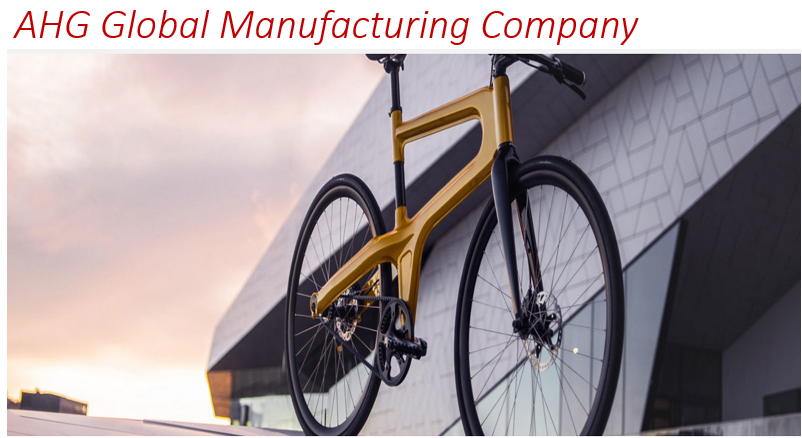

## Introduction
AHG is a global manufacturing organisation with operations in America, Europe and Asia. AHG is a global manufacturing organisation with operations in America, Europe and Asia. It is an online specialty retailer and reseller of road bikes, touring and mountain bikes, clothing accessories and components. AHG delivers personalized services with dynamic interactive experience designed to make you knowledgeable and confident of every product it offers. 

## Problem Statement
AHG has been experiencing a shift in the market place towards digital which is possibly leading to decline in its’s store sales – Is this true and can it be proven with data?
AHG is also experiencing a decline in it’s store sales as a result of change in customer demographics - Is this true and can it be proven with data?
Identify the products and regions that are performing badly against the market or when benchmarked against manufacturers of similar products
Identify most profitable products, regions, sales channel and customer demography
If products where to be shelved in the stores, or advertised online, what products may be shelved together given that these products are historically purchased together. Association analysis?
What should AHG Digital strategy be? Should it close its stores(it doesn’t have a store, only resellers, which resellers have low impact- can we move end terms with them?) and migrate fully online across all regions, some regions(some resellers based on regions)? If some, which regions should be migrated fully online, and what is the likely impact of this aggressive strategy (cost benefit analysis – volume and revenue)?

## Data Sourcing
Data was sourced from AdeventureWorks Database DW2017 and was imported into Microsoft Power BI for cleaning, analysis and visualization while data of competitors was sourced from an excel file.

## Skills/Competencies/Concepts Demonstrated
- Business understanding
- Developing Queries for Microsoft Server SQL Server (Joins, Market Basket Analysis or Association Analysis)
- Consolidating the extracted datasets into a single robust dataset
- Carrying out exploratory analysis on the data including reviewing the metadata, identifying missing values, anomalies, extreme values and distribution of the variables 
- Merging Data 
- Manipulating the data including data cleansing, checking format of the variables, deriving new variables and filtering data 
- Dealing with Missing Data and anomalies 
- Data Cleansing 
- Summarising Data, Basic Segmentation 
- Forecasting 
- Measures of Central Tendencies 
- Deriving new variables 
- MIR, Dashboard development, KPI generation
- Analysing/Modelling the data and creating bespoke outputs using advanced visualisation 
- Generating insights and making actionable recommendations based on findings.

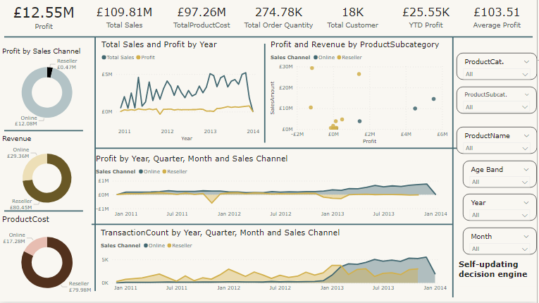

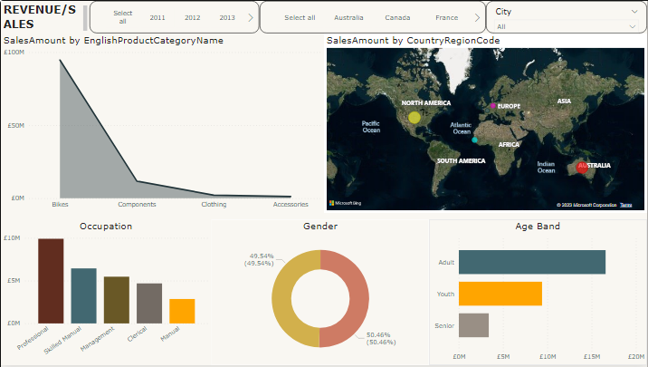

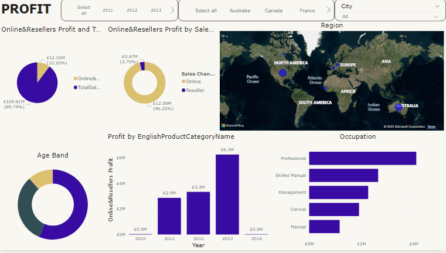

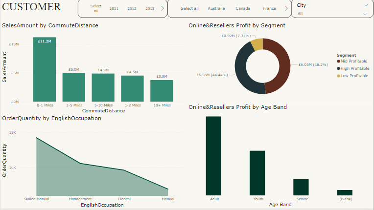

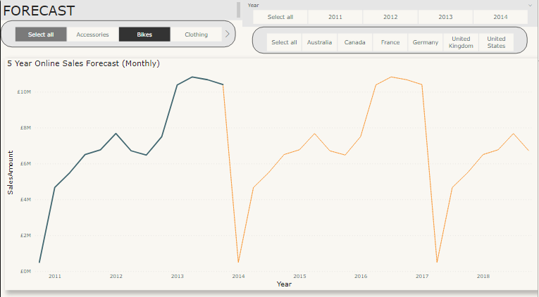

Forecast1                     |                Forecast2
:----------------------------:|:------------------------------:
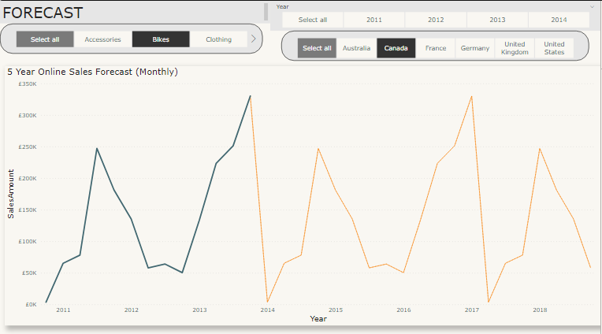            |      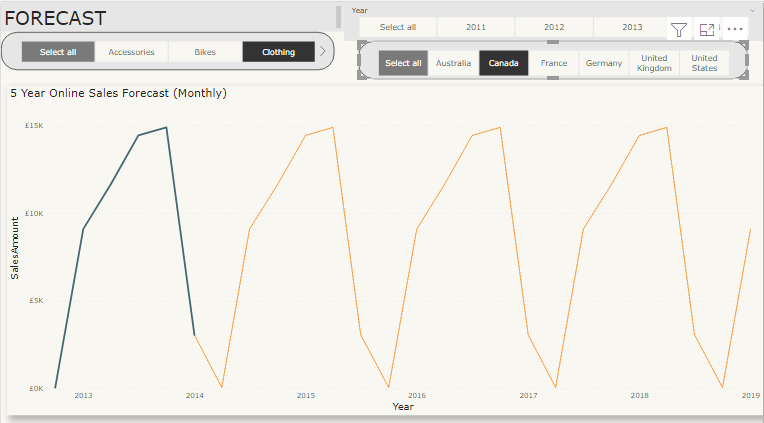

Forecast3                     |                Forecast4
:----------------------------:|:------------------------------:
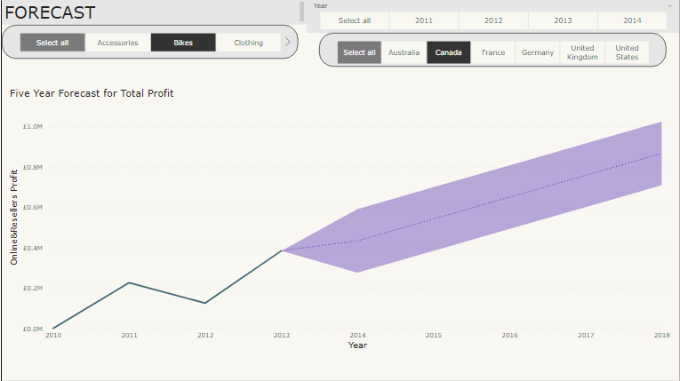            |      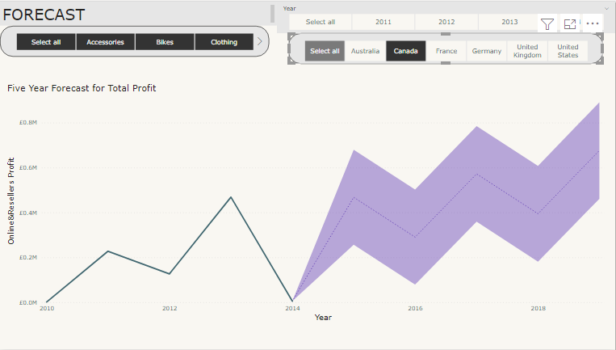

 Ass.Analysis                 |                Ass.Analysis1
:----------------------------:|:------------------------------:
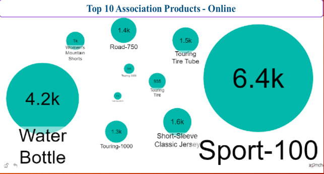            |      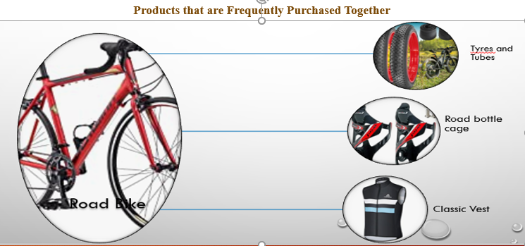

Ass.Analysis2                 |                Ass.Analysis3
:----------------------------:|:------------------------------:
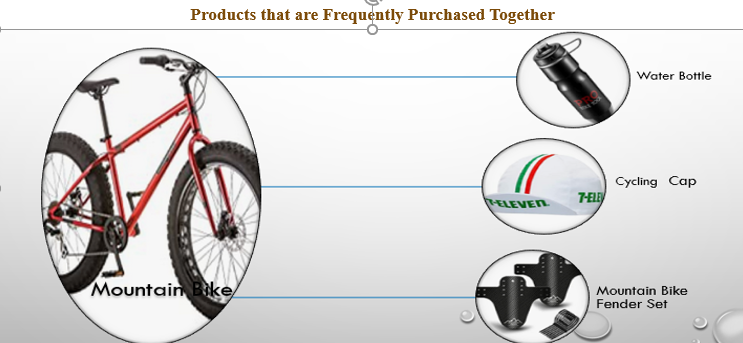            |      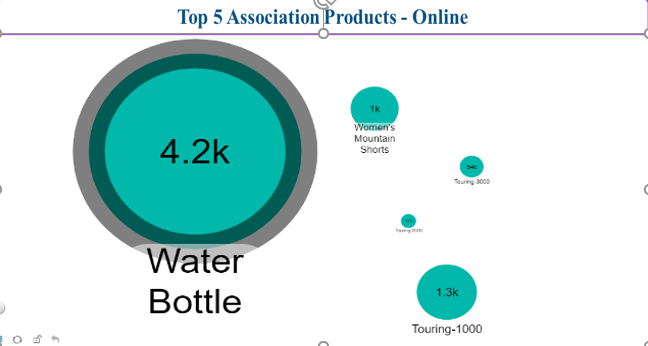

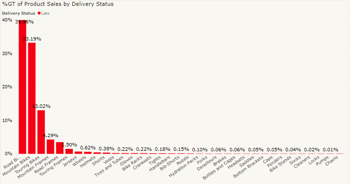

## Conclusion and Recommendations
- In conclusion, AHG experienced a clear shift towards the digital space (Online) in 2010 and recorded sales with the value of £43,421.03 and recorded a profit of £17,848.97. 
- Available data reveals that while Reseller Sales generated the highest revenue of £80,450,596.98 during the period of review, 2010 – 2014, Profit was £470,482.60 while Online sales was £29,358,677.22 with Profit of £12,080,863.65. 
- In view of the above information, Online Sales is much more profitable than Reseller Sales 
- Accessories and Clothing were accepted when introduced online 
- Bike is the company’s major and most profitable product
- AHG needs to open new online markets in other regions and cities yet to be penetrated with cheaper delivery options
- AHG should develop and implement a new pricing policy that will prevent loses and at the same time be competitive
- AHG should introduce promotional features such as loyalty offers, gift vouchers, additional products etc. to attract new customers and retain existing ones
- Increase investment in other production lines which includes accessories and clothing. This is to enhance production, market competitiveness, earn a higher return on investment and market share
- There is an urgent need to improve on delivery days by ensuring that products are delivered within the specified period. This rebuilds customer confidence
- The need to identify new potential markets with less competition cannot be overemphasized. This is to focus on new customers to purchase the products

